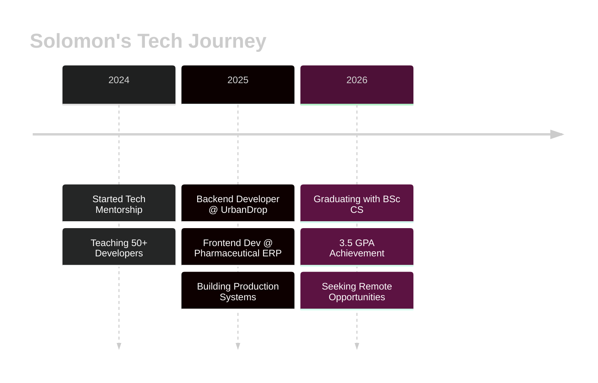

<!-- Header Banner -->
<p align="center">
  
</p>

<!-- Animated Typing -->
<p align="center">
  
</p>

<!-- Social Badges with Glow Effect -->
<p align="center">
  <a href="https://ley-roy.vercel.app/">
    
  </a>
  <a href="https://linkedin.com/in/leyroy">
    
  </a>
  <a href="mailto:atiwensolomon@gmail.com">
    
  </a>
  <a href="https://github.com/leyroy">
    
  </a>
</p>

<!-- Status Badges -->
<p align="center">
  
  
  
</p>

<br/>

<!-- Gradient Divider -->


<br/>

<!-- About Me Section with Cards -->
<h2 align="center">
  
  About Me
</h2>

<div align="center">

<table>
<tr>
<td width="50%" valign="top">

### 👨‍💻 **Who I Am**

```typescript
const solomon = {
    title: "Backend Engineer",
    company: "UrbanDrop (UK Startup)",
    location: "Kumasi, Ghana 🇬🇭",
    experience: "3+ years",
    
    education: {
        degree: "BSc Computer Science",
        university: "AAMUSTE",
        gpa: "3.5/4.0",
        status: "Final Year"
    },
    
    specialties: [
        "RESTful API Development",
        "Database Architecture", 
        "Authentication Systems",
        "Payment Integration",
        "Real-time Data Processing"
    ],
    
    currentProjects: {
        urbanDrop: "Delivery platform APIs",
        pharmaERP: "Procurement workflows",
        mentorship: "Teaching 50+ developers"
    }
};
```

</td>
<td width="50%" valign="top">

### 🔥 **What I'm Doing**

**🛒 UrbanDrop (UK Remote)**
```
→ Building delivery platform backend
→ PostgreSQL schema architecture  
→ Secure payment processing
→ Role-based access control
→ Order management system
```

**💊 Pharmaceutical ERP**
```
→ Procurement module frontend
→ Multi-level approval workflows
→ Vendor quotation system
→ Compliance & audit trails
→ Automated notifications
```

**👨‍🏫 Tech Mentorship**
```
→ Teaching React & JavaScript
→ Guiding 50+ developers
→ Code reviews & best practices
→ Deployment & DevOps training
```

</td>
</tr>
</table>

</div>

<br/>

<!-- Gradient Divider -->


<br/>

<!-- Tech Stack -->
<h2 align="center">
  
  Tech Arsenal
</h2>

<div align="center">

### **🎯 Core Technologies**


<br/><br/>

### **💻 Backend & Databases**


### **🎨 Frontend & Styling**


### **🛠️ Tools & DevOps**


</div>

<br/>

<!-- Gradient Divider -->


<br/>

<!-- Featured Projects -->
<h2 align="center">
  
  Featured Projects
</h2>

<div align="center">

<table>
<tr>
<td width="50%">
<h3 align="center">🏠 Household Services Platform</h3>
<div align="center">  


<br/><br/>
<p><strong>Full-stack booking & management system</strong></p>
<p align="left">
✨ Real-time order tracking<br/>
✨ Automated worker assignment<br/>
✨ Dynamic profit distribution<br/>
✨ Secure payment gateway<br/>
✨ Comprehensive admin panel<br/>
✨ Analytics dashboard
</p>
<br/>
<a href="https://household-services.vercel.app" target="_blank">

</a>
</div>
</td>

<td width="50%">
<h3 align="center">🤖 AI Programming Interviewer</h3>
<div align="center">


<br/><br/>
<p><strong>AI-powered technical assessment platform</strong></p>
<p align="left">
🚀 Automated coding interviews<br/>
🚀 Dynamic question generation<br/>
🚀 Real-time code evaluation<br/>
🚀 Detailed feedback reports<br/>
🚀 Skill assessment algorithms<br/>
🚀 Performance analytics
</p>
<br/>
<a href="https://ai-interviewer.vercel.app" target="_blank">

</a>
</div>
</td>
</tr>
</table>

</div>

<br/>

<!-- Gradient Divider -->


<br/>

<!-- GitHub Stats -->
<h2 align="center">
  
  GitHub Performance
</h2>

<div align="center">


<br/>


<br/>


</div>

<br/>

<!-- Gradient Divider -->


<br/>

<!-- Experience Timeline -->
<h2 align="center">
  
  Professional Journey
</h2>

<div align="center">



</div>

<br/>

<div align="center">

<table>
<tr>
<td width="33%" align="center">

<h3>💼 UrbanDrop</h3>
<p><strong>Backend Developer</strong></p>
<p>2025 - Present</p>
<hr/>
<p align="left">
🔹 Delivery platform APIs<br/>
🔹 Payment integration<br/>
🔹 Order management<br/>
🔹 Database architecture<br/>
🔹 Security implementation
</p>
</td>

<td width="33%" align="center">

<h3>💊 Pharma ERP</h3>
<p><strong>Frontend Developer</strong></p>
<p>2025 - Present</p>
<hr/>
<p align="left">
🔹 Procurement workflows<br/>
🔹 Approval systems<br/>
🔹 Vendor management<br/>
🔹 Compliance features<br/>
🔹 Notification system
</p>
</td>

<td width="33%" align="center">

<h3>👨‍🏫 Mentorship</h3>
<p><strong>Tech Tutor</strong></p>
<p>2024 - Present</p>
<hr/>
<p align="left">
🔹 Teaching React/JS<br/>
🔹 50+ students mentored<br/>
🔹 Project guidance<br/>
🔹 Code reviews<br/>
🔹 Career coaching
</p>
</td>
</tr>
</table>

</div>

<br/>

<!-- Gradient Divider -->


<br/>

<!-- Achievements -->
<h2 align="center">
  
  Achievements & Impact
</h2>

<div align="center">

<table>
<tr>
<td align="center" width="20%">

<br/><strong>10+</strong>
<br/>Production Apps
</td>
<td align="center" width="20%">

<br/><strong>50+</strong>
<br/>Developers Mentored
</td>
<td align="center" width="20%">

<br/><strong>3+</strong>
<br/>Years Experience
</td>
<td align="center" width="20%">

<br/><strong>3.5</strong>
<br/>GPA Achievement
</td>
<td align="center" width="20%">

<br/><strong>∞</strong>
<br/>APIs Built
</td>
</tr>
</table>

</div>

<br/>

<!-- Gradient Divider -->


<br/>

<p align="center">
  
</p>

<!-- Contact Section -->
<h2 align="center">
  
  Let's Build Something Together
</h2>

<div align="center">


<br/><br/>

<table>
<tr>
<td align="center" width="33%">

<br/><br/>
<strong>Email</strong>
<br/>
<a href="mailto:atiwensolomon@gmail.com">atiwensolomon@gmail.com</a>
</td>
<td align="center" width="33%">

<br/><br/>
<strong>Phone</strong>
<br/>
+233 554290614<br/>+233 597840053
</td>
<td align="center" width="33%">

<br/><br/>
<strong>Location</strong>
<br/>
Kumasi, Ghana 🇬🇭
</td>
</tr>
</table>

<br/>

### 🌟 **OPEN TO OPPORTUNITIES IN:**
**Backend Development • API Architecture • System Design • Full-Stack Engineering**

<br/>


</div>

<br/>

<!-- Footer -->
<p align="center">
  
</p>

<div align="center">

### ⭐ **Star my repositories if you find them interesting!** ⭐

</div>
